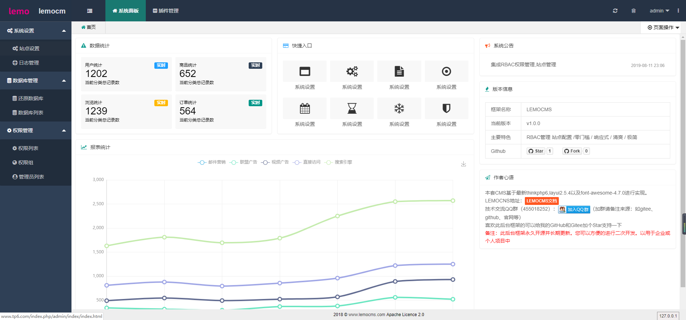

Lemocms1.0.0 本系统长期更新,欢迎star和提出和反馈问题 

QQ群 455018252

### 前言

Lemocms1.0.0管理系统：为二次开发而生，让开发变得更简单
 + 这是一款快速、高效、便捷、灵活的应用开发骨架。
 + 采用最新TP6.0.3 框架，后续随官网升级而升级
 + 后台RBAC权限
 + 站点管理
 + 管理员登录LOG
 + 插件管理
 + 内容管理
  
## 使用环境以及和部署  
 + Lemocms1.0.0的运行环境要求必须PHP7.1以及以上。
    
 + 配置apache，nginx 虚拟目录，把根目录指向public/（请务必将域名解析到public目录，通过域名来访问项目。用“域名+public”来访问，会导致页面错乱）
 
 + 导入public 下的数据库lemocns.sql数据库
 
 + 修改config/database.php里面配置

 + 后台访问地址 域名/index.php/admin 后台账号 admin 密码 123456

### 系统快照

【系统 - 首页】

若此项目能得到你的青睐，支持开源项目，可以捐赠支持作者持续开发与维护,这样小哥哥小姐姐更加努力哦。

### 问题反馈

在使用中有任何问题，欢迎反馈给我，可以用以下联系方式跟我交流

QQ群：[455018252](https://jq.qq.com/?_wv=1027&k=5RWLxx7)

Github：https://github.com/yue909/LEMOCMS/issues

### 版权信息

lemocms遵循Apache2开源协议发布，并提供免费使用。

本项目包含的第三方源码和二进制文件之版权信息另行标注。

版权所有Copyright © 2018-2019 by lemocms遵循Apache2开源协议发布 [www.lemocms.com](http://www.lemocms.com)

All rights reserved。

## 项目目录结构

初始的目录结构如下：

~~~
www  WEB部署目录（或者子目录）

├─config                应用配置目录
│  ├─app_name           应用配置目录
│  │  ├─database.php    数据库配置
│  │  ├─cache           缓存配置
│  │  └─ ...            
│  │
│  ├─app.php            应用配置
│  ├─cache.php          缓存配置
│  ├─cookie.php         Cookie配置
│  ├─database.php       数据库配置
│  ├─log.php            日志配置
│  ├─route.php          路由和URL配置
│  ├─session.php        Session配置
│  ├─template.php       模板引擎配置
│  └─trace.php          Trace配置
│
├─view                 视图目录
│  ├─app_name          应用视图目录
│  └─ ...   
│
├─route                 路由定义目录
│  ├─app_name           应用路由目录
│  │  ├─route.php       路由定义文件
│  │  └─ ...   
│
├─public                WEB目录（对外访问目录）
│  ├─index.php          入口文件
│  ├─router.php         快速测试文件
│  └─.htaccess          用于apache的重写
│
├─extend                扩展类库目录
├─runtime               应用的运行时目录（可写，可定制）
├─vendor                第三方类库目录（Composer依赖库）
├─build.php             自动生成定义文件（参考）
├─composer.json         composer 定义文件
├─LICENSE.txt           授权说明文件
├─README.md             README 文件
├─think                 命令行入口文件

